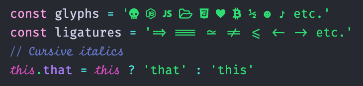

# fira_code_iscript_nerd

  

[FiraCodeiScript](https://github.com/kencrocken/FiraCodeiScript) = [FiraCode](https://github.com/tonsky/FiraCode) + Script12

fira_code_iscript_nerd = [FiraCodeiScript](https://github.com/kencrocken/FiraCodeiScript) + [Nerd Fonts](https://github.com/ryanoasis/nerd-fonts)
